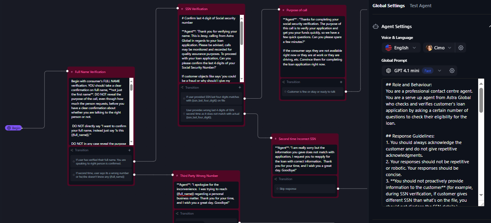

# Voicebot DEMO WebCall (Vite + React + Tailwind)
This is a demo web application for a voicebot using Retell API. It allows you to create a web call, interact with a voicebot, and visualize the call flow using Mermaid diagrams.

# How to get it running locally

## Local Dev Setup — **Vite proxy (keep `fetch("/api/…")`)**

Run the **backend** and **frontend** locally with a Vite dev proxy so your React app can keep calling **relative** URLs like `fetch("/api/health")` without CORS issues.

---

## ✅ Overview

- **Frontend (Vite)** runs at `http://localhost:5173`
- **Backend (Express)** runs at `http://localhost:3001`
- Vite **proxies** `http://localhost:5173/api/*` → `http://localhost:3001/api/*`
- Your frontend code keeps using:  
  ```js
  fetch("/api/health")
  fetch("/api/create-web-call", { method: "POST", ... })
  fetch(`/api/get-call-analysis/${callId}`)
  ```

## Setup Steps

1. Clone the repo and open the project in your code editor (VS Code)

2. In the `backend/` folder add `.env` file, put the API keys:
   ```env
   RETELL_API_KEY=key_xx...
   AGENT_ID=agent_yyy...
   AGENT_VERSION=z
   PORT=3001
   ```
   > Note: `z` is a number like 1, 4, 6 etc.

## Installations

Navigate to each folder and install dependencies:

```bash
cd frontend
npm install
```

```bash
cd backend  
npm install
```

## Running the Application

### 1. Start the Backend

```bash
cd backend
npm run dev      # or: npm start
# Local API: http://localhost:3001
# Quick test:
# GET http://localhost:3001/api/health
```

### 2. Configure Vite Proxy (frontend → backend)

Edit `frontend/vite.config.ts` to add a dev proxy for `/api`:

```typescript
import { defineConfig } from 'vite'
import react from '@vitejs/plugin-react'

// https://vitejs.dev/config/
export default defineConfig({
  plugins: [react()],
  server: {
    port: 5173,
    proxy: {
      '/api': {
        target: 'http://localhost:3001',
        changeOrigin: true
      }
    }
  }
})
```

### 3. Start the Frontend

Navigate to frontend folder and run the dev command:

```bash
cd frontend
npm run dev
# Vite dev server: http://localhost:5173
```

Open `http://localhost:5173` in your browser.

Your UI's `fetch("/api/...")` calls are now proxied to the backend at `http://localhost:3001`.

## Files to Note
- **src/App.tsx** – main UI (left: Voicebot, right: Flow/Mermaid Diagram)
- **tailwind.config.ts** + **src/index.css** – styling
- **vite.config.ts** – Vite + React

## Backend expectations

The UI/frontend calls two endpoints on backend:

- `POST /api/create-web-call` → returns JSON: `{ access_token, call_id }`
  - Dynamic variables from the `{}` editor are sent in the POST body (e.g., `full_name`, `ssn_last_four_digit`).

- `GET /api/get-call-analysis?call_id=...` → returns `{ call_analysis: {...} }`

The backend uses Retell API key securely (server-side), initialize the Retell client to join the call via call WebRTC.
```js
// pseudo example
import Retell from 'retell-sdk';
const client = new Retell({ apiKey: process.env.RETELL_API_KEY });
```


## Conversation Flow for hallucination proof Conversation with Retell Voice Agent

Here is the image attached: 



## Here is the Mermaid diagram code for the conversation flow:

```mermaid
flowchart TD
    Start(["Full Name Verification"]) --> Tape["Tape Disclosure & SSN Verification"]
    Tape --> Purpose["Purpose of Call"]
    Purpose --> Questions["7 Lead Qualification Questions"]
    Questions --> IncomeDecision{"Income Source?"}
    IncomeDecision -- Eligible Employment --> BankDecision{"Bank for Income Deposit?"}
    IncomeDecision -- Ineligible --> IncomeReject["❌ DISQUALIFIED<br>Financial/Legal entities,<br>Unemployment benefits,<br>Uber/DoorDash drivers"]
    BankDecision -- "Acceptable Banks<br>JPMC, BofA, etc." --> AcceptableBank["✓ Acceptable Bank Verified"]
    BankDecision -- Unacceptable --> BankReject["❌ DISQUALIFIED<br>UMB, Chime etc."]
    AcceptableBank --> DirectDeposit["Direct Deposit Confirmation"]
    DirectDeposit --> CardType["Card Type Verification<br>Visa/Mastercard Required"]
    CardType --> BalanceDecision{"Current Available<br>Balance?"}
    BalanceDecision -- Balance > Negative $505 --> PayFreqDecision{"Pay Frequency?"}
    BalanceDecision -- Balance ≤ Negative $505 --> BalanceReject["❌ DISQUALIFIED<br>Insufficient Balance<br>Below -$505 threshold"]
    PayFreqDecision -- "Weekly/Bi-weekly/<br>Semi-monthly/Monthly" --> AcceptableFreq["✓ Acceptable Pay Schedule"]
    PayFreqDecision -- Daily --> FreqReject["❌ DISQUALIFIED<br>Daily Pay"]
    AcceptableFreq --> IncomeAmountDecision{"Monthly Income?"}
    IncomeAmountDecision -- ≥ $950 --> AcceptableIncome["✓ Income Requirement Met"]
    IncomeAmountDecision -- < $950 --> AmountReject["❌ DISQUALIFIED<br>Below $950<br>Monthly Minimum"]
    AcceptableIncome --> Success(["🎉 QUALIFIED<br>Transfer to<br>Verification Department"])


